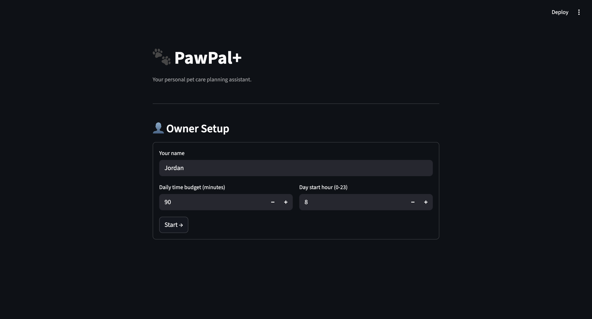

# 🐾 PawPal+

> **Your personal pet care planning assistant** — built with Python, Streamlit, and Gemini AI.

PawPal+ helps busy pet owners stay consistent with their pet care routine. It lets you track pets and tasks, generates a smart daily schedule based on your time budget and priorities, detects conflicts, and automatically creates the next occurrence of recurring tasks when you mark one complete. In its latest version, the app gains an AI-powered suggestion engine that analyzes each pet's current care routine and recommends missing tasks — with built-in safety guards to keep the AI focused, honest, and rate-limited.

---

## 📋 Table of Contents

- [Original Project (Modules 1–3)](#-original-project-modules-13)
- [What Changed in the AI Module](#-what-changed-in-the-ai-module)
- [Features](#-features)
- [System Architecture](#-system-architecture)
- [Setup Instructions](#-setup-instructions)
- [Running the App](#-running-the-app)
- [Sample Interactions](#-sample-interactions)
- [Design Decisions](#-design-decisions)
- [Testing Summary](#-testing-summary)
- [Reflection](#-reflection)
- [Project Structure](#-project-structure)

---

## 📌 Original Project (Modules 1–3)

**PawPal+** started as a pure Python scheduling tool for pet owners. The goal was simple: given a list of pets, tasks, priorities, and a daily time budget, generate a conflict-free care schedule using a greedy knapsack algorithm. The app also handled recurring tasks (daily, weekly, weekdays), same-time conflict detection, and a clean Streamlit UI with sort/filter controls. Every piece of logic lived in `pawpal_system.py` — a zero-I/O layer of six SOLID classes (`Task`, `Pet`, `ScheduledSlot`, `Schedule`, `Scheduler`, `Owner`) — while `app.py` was responsible only for rendering. The test suite validated 70 behaviors across all classes, covering happy paths, boundary conditions, and edge cases.

---

## 🔄 What Changed in the AI Module

The core scheduling logic stayed exactly the same. What the AI module added was a fifth section in the UI and an entirely new file — `ai_agent.py` — that gives the app an agentic capability: analyzing a pet's current care data and recommending tasks the owner might have missed.

The agent talks to Google's Gemini 2.5 Flash model. It builds a structured context from the live `Owner` object (pending tasks, completed tasks, overdue items, empty time slots, available minutes), turns that into a prompt, and parses the JSON response back into typed `TaskSuggestion` objects. The owner then reviews each suggestion in the UI and either accepts it (which creates a real task) or dismisses it.

Because AI outputs can be unpredictable, four guard layers were added on top of the raw API call to keep the system safe and focused:

- **Scope lock** — the prompt explicitly tells Gemini it is a pet care assistant only and must return an empty suggestions array if it cannot stay on topic.
- **Output validator** — every field in every suggestion is checked against allowed values before it reaches the UI. Invalid priorities, unknown categories, durations outside a 5–480 minute window, and blank or oversized titles are all silently filtered out.
- **Deduplication filter** — even if Gemini ignores the "don't repeat existing tasks" rule in the prompt, a case-insensitive post-processing step strips any suggestion whose title already exists in the pet's task list.
- **Session rate limiter** — the UI enforces a 60-second per-pet cooldown and a cap of 10 API calls per session, preventing accidental cost blowout.

The test suite grew from 70 to 122 tests to cover all of this new behavior.

---

## ✨ Features

### 🗂 Pet & Task Management

- **Multi-pet support** — each pet maintains its own independent task list.
- **Full task CRUD** — create, edit, complete, and delete tasks from the UI. Each task stores title, duration, priority, category, preferred time slot, and optional notes.
- **Task status tracking** — tasks move through `pending → in_progress → completed` states with a single dropdown.

---

### 🧠 Scheduling Algorithm (Greedy Knapsack)

- **Priority-first scheduling** — `Scheduler.generate()` sorts tasks by priority (`high → medium → low`) before assigning time slots. Within the same priority, shorter tasks are placed first to maximise the number of tasks that fit in the daily budget.
- **Time slot assignment** — scheduled tasks are assigned sequential `start_minute` / `end_minute` offsets via `ScheduledSlot`, rendered as human-readable `HH:MM–HH:MM` labels.
- **Budget overflow handling** — tasks that exceed the remaining time budget go into an "Unscheduled / Skipped" list, never silently dropped.
- **Due-date filtering** — tasks with a future `due_date` are excluded from today's schedule automatically.

---

### 🔁 Recurring Tasks

- **Daily** — creates a new pending copy with `due_date = today + 1 day`.
- **Weekly** — advances `due_date` by 7 days.
- **Weekdays** — after Friday, skips Saturday and Sunday and lands on Monday.
- **One-off** — tasks with `recurrence="none"` are marked complete without spawning a follow-up.

---

### ⚠️ Conflict Detection

- **Layer 1** — same-time clash detection runs live on every page render, scanning all pending tasks for the selected pet and flagging any time string with more than one task.
- **Layer 2** — preferred time-slot overload checks whether any `morning / afternoon / evening` slot exceeds its soft capacity in total minutes after the greedy fill.

---

### 🤖 AI Task Suggestions (Agentic Workflow)

- **Gemini-powered analysis** — `PawPalAgent.get_suggestions()` retrieves live pet context, builds a structured prompt, calls Gemini 2.5 Flash, and returns a typed list of `TaskSuggestion` objects.
- **Guard pipeline** — scope lock → field validation → deduplication, applied to every API response before any suggestion reaches the UI.
- **Human review step** — each suggestion is shown as a card with a one-sentence reason and an expandable detailed reasoning. The owner clicks Accept (creates a task) or Dismiss.
- **Rate limiting** — 60-second per-pet cooldown and 10-call session cap shown via usage counter below the Analyze button.
- **Slot conflict warning** — if a suggestion targets a time slot already occupied by a pending task, a warning is shown on the card before the owner accepts.

---

## 🏗 System Architecture

PawPal+ is split into three layers: a Streamlit UI (`app.py`), a pure-logic layer (`pawpal_system.py`), and an agentic workflow layer (`ai_agent.py`). Data flows from user input through the retriever, to the agent, through the evaluator guards, and back to the UI for human review.

```
┌─────────────────────────────────────────────────────────────┐
│                      app.py (UI Layer)                      │
│  Sections 1–4: CRUD, schedule, sort/filter, conflicts       │
│  Section 5:    AI Suggestions + Rate Limiter (Guard 4)      │
└────────────┬───────────────────────────┬────────────────────┘
             │ CRUD calls                │ get_suggestions()
             ▼                           ▼
┌────────────────────────┐   ┌───────────────────────────────────┐
│  pawpal_system.py      │   │         ai_agent.py               │
│  Owner → Pet → Task    │◄──│  Retriever: build_context()       │
│  Scheduler → Schedule  │   │  Agent:     format_prompt()       │
│  ScheduledSlot         │   │             + SCOPE lock (Guard 1)│
└────────────────────────┘   │             → Gemini 2.5 Flash    │
                             │  Evaluator: _is_valid_suggestion() │
                             │             (Guard 2 + Guard 3)    │
                             │  Output:    list[TaskSuggestion]   │
                             └───────────────────────────────────┘
```

| Component | Role |
|-----------|------|
| **Retriever** | `build_context()` — pulls live pet/task/slot data from `Owner` into a structured dict |
| **Agent** | `PawPalAgent` — builds scoped prompt, calls Gemini, parses JSON response |
| **Evaluator** | Guard 2 (`_is_valid_suggestion`) + Guard 3 (dedup) — filters every API response field-by-field |
| **Rate Limiter** | Guard 4 in `app.py` — enforces cooldown and session cap before any API call is made |
| **Human Review** | Accept / Dismiss UI — the final gate before a suggestion becomes a real task |
| **Tester** | pytest — 122 automated tests cover all layers; Gemini is monkeypatched, never called in tests |

---

## 🚀 Setup Instructions

### Prerequisites

- Python 3.11+
- pip
- A free [Gemini API key](https://aistudio.google.com/app/apikey) (for the AI suggestions feature)

### Steps

```bash
# 1. Clone the repo
git clone <your-repo-url>
cd pawpal

# 2. Create and activate a virtual environment
python3 -m venv .venv
source .venv/bin/activate        # Windows: .venv\Scripts\activate

# 3. Install dependencies
pip install -r requirements.txt

# 4. Add your Gemini API key
echo "GEMINI_API_KEY=your_key_here" > .env
```

The `.env` file is loaded automatically at startup via `python-dotenv`. The app runs without a key — the AI suggestions section shows a setup message instead of the Analyze button.

---

## ▶️ Running the App

```bash
streamlit run app.py
```

Opens at **http://localhost:8501**.

```bash
# Run the full test suite
python -m pytest tests/test_pawpal.py tests/test_ai_agent.py -v

# Run a single test class
python -m pytest tests/test_ai_agent.py::TestIsValidSuggestion -v
```

---

## 💬 Sample Interactions

### Example 1 — AI suggests missing care tasks for a Shiba Inu

**Input context (built automatically from the app state):**
```
Pet: Mochi — 3-year-old Shiba Inu dog
Daily budget: 90 minutes
Pending tasks: Morning Walk (morning slot, 20 min)
Completed tasks: none
Overdue tasks: none
Empty slots: afternoon, evening
```

**Gemini output (after guard pipeline):**
```json
{
  "suggestions": [
    {
      "title": "Dental chew",
      "duration_minutes": 5,
      "priority": "medium",
      "category": "grooming",
      "preferred_time_slot": "evening",
      "reason": "Prevents tartar buildup common in Shiba Inus.",
      "reasoning": "Mochi has no grooming tasks at all. Shiba Inus are prone to dental issues and a nightly dental chew is a low-effort, high-impact habit to establish early at age 3."
    },
    {
      "title": "Puzzle feeder",
      "duration_minutes": 15,
      "priority": "low",
      "category": "enrichment",
      "preferred_time_slot": "afternoon",
      "reason": "Mental stimulation reduces anxiety and destructive behavior.",
      "reasoning": "The afternoon slot is empty and there are zero enrichment tasks. Shiba Inus are intelligent and independent — mental stimulation is as important as physical exercise."
    }
  ]
}
```

**What happens next:** Both suggestions appear as cards in the UI. The owner clicks Accept on "Dental chew" — a real task is created with all fields pre-filled. "Puzzle feeder" is dismissed.

---

### Example 2 — Guard blocks an off-topic suggestion

**Gemini returns (hypothetical hallucination):**
```json
{
  "suggestions": [
    {
      "title": "Check stock portfolio",
      "duration_minutes": 30,
      "priority": "high",
      "category": "finance",
      "preferred_time_slot": "morning",
      "reason": "Monitor investments.",
      "reasoning": "Good time to review stocks."
    }
  ]
}
```

**Guard 2 output:** `_is_valid_suggestion()` rejects it — `"finance"` is not in `_VALID_CATEGORIES`. The suggestion is filtered out silently. The UI shows "0 suggestions found."

---

### Example 3 — Guard deduplicates an already-existing task

**Existing task:** "Morning Walk" (pending, morning slot)

**Gemini ignores the dedup rule and returns:**
```json
{
  "suggestions": [
    { "title": "Morning Walk", "category": "walk", "priority": "high", ... },
    { "title": "MORNING WALK", "category": "walk", "priority": "high", ... }
  ]
}
```

**Guard 3 output:** Both are stripped by the case-insensitive dedup filter. Zero suggestions reach the UI — the owner is not shown redundant cards.

---

### Example 4 — Rate limiter blocks a rapid second request

**User clicks "Analyze" for Mochi, then immediately clicks again.**

**UI output:**
```
⚠️ Wait 58s before re-analyzing Mochi.
AI analyses used this session: 1/10
```

The second API call never reaches Gemini.

---

## 🧩 Design Decisions

### Why keep `pawpal_system.py` untouched?

The original logic layer had clean SOLID boundaries and 70 passing tests. Adding AI on top of a stable foundation was safer than interleaving AI logic into existing classes. `PawPalAgent` depends on `Owner` via method calls — it never modifies `pawpal_system.py`. This means the scheduling system continues to work perfectly even if the AI feature is disabled or the API key is missing.

### Why validate outputs instead of trusting the prompt?

Prompting is soft. Even a well-written prompt with explicit rules gets ignored occasionally, especially with complex JSON schemas. Field-level validation (`_is_valid_suggestion`) is hard — it runs deterministically every time regardless of model behavior. The cost is minimal (a list comprehension) and the benefit is that the UI layer never has to handle unexpected values from an LLM.

### Why put rate limiting in `app.py` instead of `ai_agent.py`?

Rate limiting is a session concern, not a logic concern. `PawPalAgent` is a stateless class — it takes context in, calls the API, returns results. Session counters and timestamps belong to `st.session_state`, which only `app.py` owns. Putting rate limiting in the agent would force it to know about Streamlit, which breaks the separation of concerns.

### Trade-offs

| Decision | Upside | Trade-off |
|----------|--------|-----------|
| Greedy knapsack scheduling | Simple, predictable, fast | Not globally optimal — a DP solution would fit more tasks |
| Gemini 2.5 Flash over a larger model | Low latency, free tier available | Occasionally produces less nuanced reasoning than Opus-class models |
| Session-only rate limiting | Zero persistence overhead | Restarting the app resets the counter |
| Silent filtering of invalid suggestions | UI never shows garbage | Owner has no visibility into how many suggestions were dropped |

---

## 🧪 Testing Summary

### Coverage: 122 tests across 2 files

| File | Tests | What's covered |
|------|-------|----------------|
| `test_pawpal.py` | 71 | Owner, Pet, Task, Scheduler, Schedule, recurrence, conflict detection, sorting |
| `test_ai_agent.py` | 51 | `build_context`, `format_prompt`, `get_suggestions`, `_is_valid_suggestion`, guard filters, dedup |

### What worked

TDD made the guard implementation straightforward. Writing the tests first (`test_invalid_category_returns_false`, `test_dedup_is_case_insensitive`, etc.) clarified exactly what the validator needed to do before writing a single line of production code. Every guard was green before moving to the next.

The decision to mock only the Gemini client — and not the `pawpal_system.py` classes — paid off. Tests caught a real bug during development: `build_context` was building the `existing_lower` set from the context dict (which only includes pending + completed titles) rather than directly from `pet.tasks`, which meant a task added mid-session could slip through dedup. Hitting the real `Owner` object in tests surfaced that immediately.

### What didn't work

The first version of the rate limiter tracked call time inside `PawPalAgent.__init__`, which reset on every button click because the app creates a new agent instance each time. Moving the state to `st.session_state` fixed it — but this is the kind of bug that only shows up in a running app, not in unit tests, which is a limitation of session-state logic.

### What was learned

AI output validation requires thinking adversarially about your own model. The most useful mental model was: "What is the worst JSON response Gemini could plausibly return that would still parse as valid JSON?" That framing led directly to the guard cases — negative durations, unknown categories, empty titles, titles that are 500 characters long.

---

## 💭 Reflection

Building PawPal+ taught me that adding AI to an application is less about the model and more about the infrastructure around it. The Gemini API call itself is three lines. The 60 lines of guards, validation, rate limiting, and deduplication surrounding it took far longer to design and test — and they are what make the feature actually trustworthy.

The human review checkpoint (Accept / Dismiss) turned out to be the most important architectural decision. An agent that silently creates tasks would be convenient but dangerous — it could pollute a pet's task list with irrelevant or duplicate items. Keeping a human in the loop for the final decision means the AI adds genuine value (surfacing gaps the owner missed) without taking control. That balance — AI as a collaborator, human as the final authority — is something I want to carry into every future AI-powered project.

On the engineering side, the project reinforced how much SOLID principles matter when you extend a system. Because `pawpal_system.py` had clean single-responsibility classes from the start, the AI module could be added as a completely new file without touching any existing code. That kind of extensibility is not an accident — it is the result of disciplined design in the earlier modules.

---

## 📸 Demo

### Owner Setup


### Full App — Tasks, Schedule & Conflict Warnings



### UML Class Diagram


---

## 📁 Project Structure

```
pawpal/
├── app.py                  # Streamlit UI — Sections 1–5 (CRUD + AI suggestions)
├── pawpal_system.py        # Logic layer: Task, Pet, ScheduledSlot,
│                           #              Schedule, Scheduler, Owner
├── ai_agent.py             # Agentic workflow: PawPalAgent, TaskSuggestion,
│                           #                   4 guard layers
├── tests/
│   ├── conftest.py         # Adds project root to sys.path for pytest
│   ├── test_pawpal.py      # 71-test suite for core logic layer
│   └── test_ai_agent.py    # 51-test suite for agent + guards
├── .env                    # GEMINI_API_KEY (not committed)
├── requirements.txt
├── Makefile
└── README.md
```
